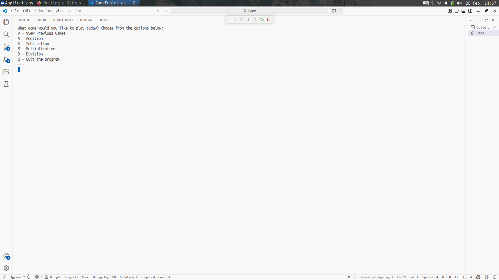

# Game

[繁體中文](./README.zh-TW.md) | English

A simple terminal-based math game built with C# where players answer randomly 
generated math questions and earn points for correct answers.



---

## Features

- Menu-based operation selection (+, -, ×, ÷)
- Minimum of 5 questions per game
- Score tracking system
- Game history stored in memory
- View previous game results

---

## Tech Stack

- C# / .NET
- Console Application

---

## Getting Started

### Run on Linux / macOS
1. Download the latest release from the [Releases page](../../releases).
2. Open a terminal and navigate to your download folder:
```bash
   cd ~/Downloads
```
3. Make the file executable:
```bash
   chmod +x Game
```
4. Run the game:
```bash
   ./Game
```

---

## 📖 How to Play

1. Launch the game and choose a math operation from the menu.
2. Answer at least 5 randomly generated questions.
3. Earn points for each correct answer.
4. View your score summary at the end.
5. Check past game results from the history menu.

---

## 🗺️ Roadmap

- [ ] Difficulty levels (Easy / Medium / Hard)
- [ ] Timer per question
- [ ] Save game history to a file
- [ ] Leaderboard

---

## 📄 License

This project is licensed under the [MIT License](LICENSE).